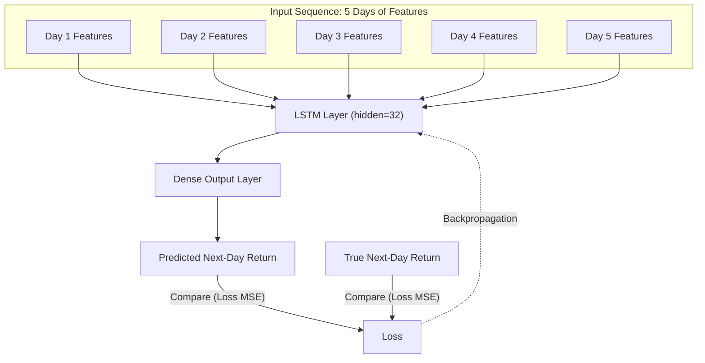

# Enhanced Stock Prediction Flowchart

- **Start at the top**: Input features for the last 5 days.
- **Rolling Window**: Use a rolling input window of 5 days of features.
- **LSTM Layer**: Process the input sequence through an LSTM layer with 32 hidden units.
- **Dense Output**: Generate the predicted next-day return using a dense output layer.
- **Loss Calculation**: Compare the predicted return with the true return using Mean Squared Error (MSE) loss.
- **Backpropagation**: Optimize the model using backpropagation based on the calculated loss.
